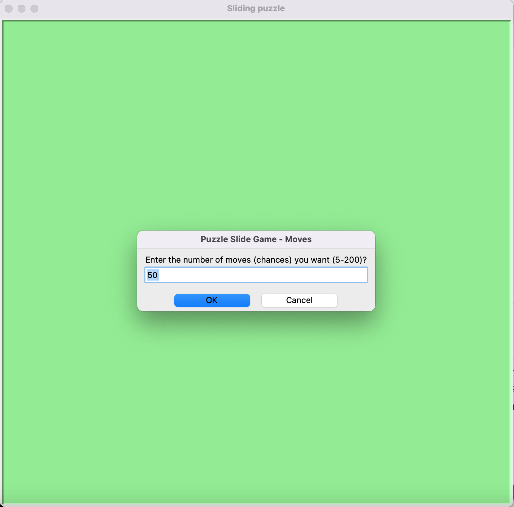
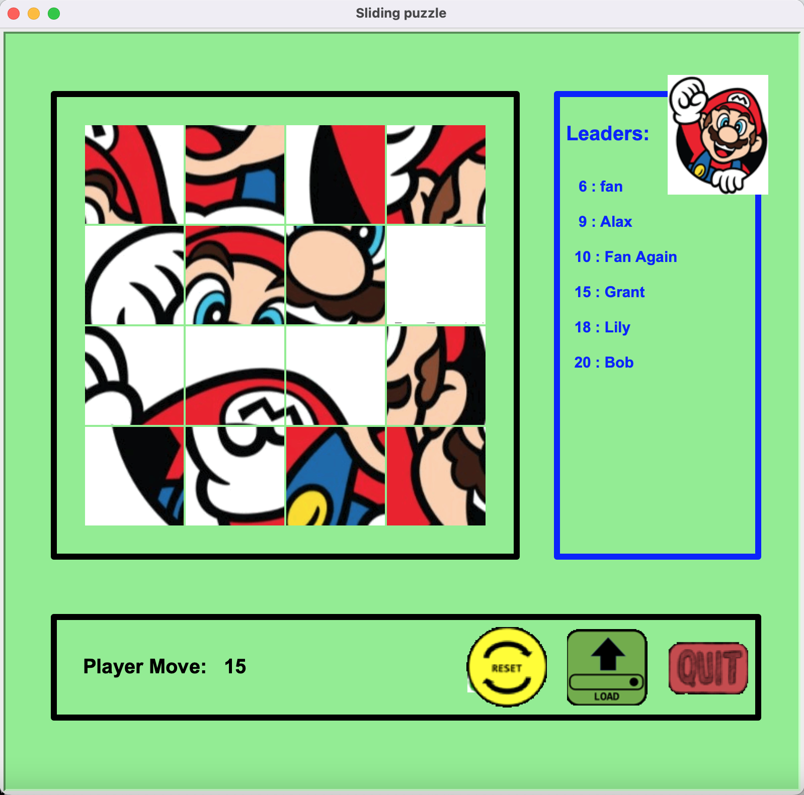
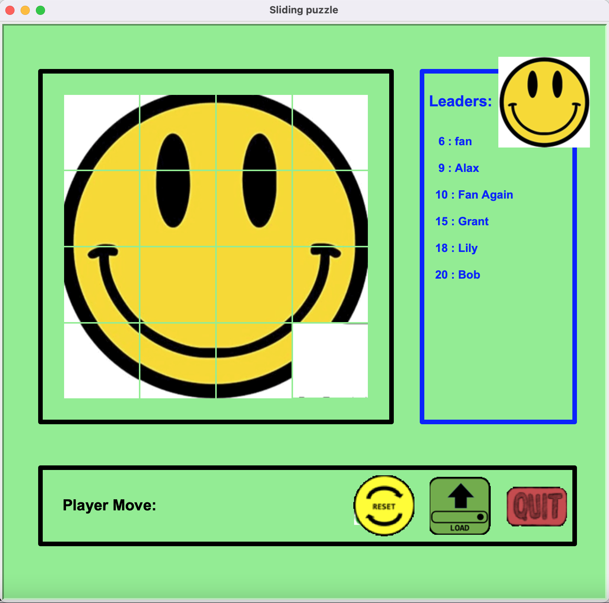
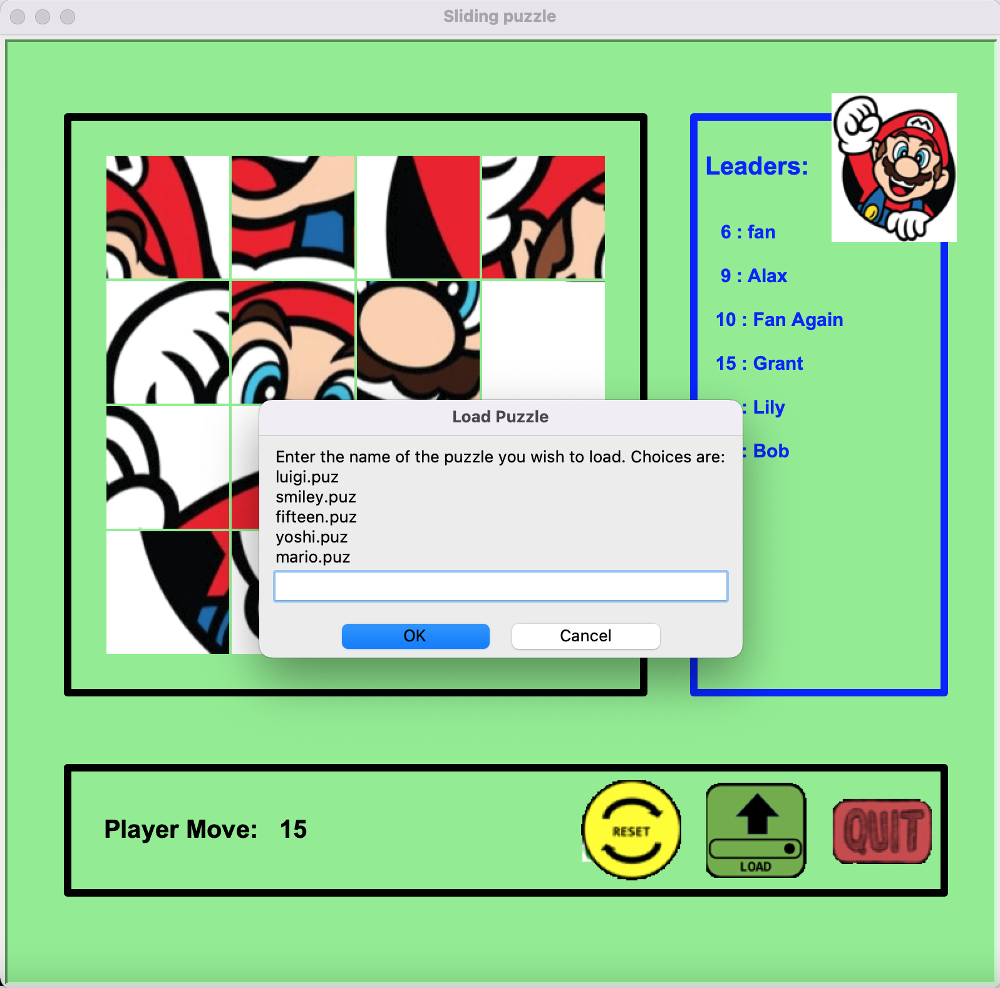
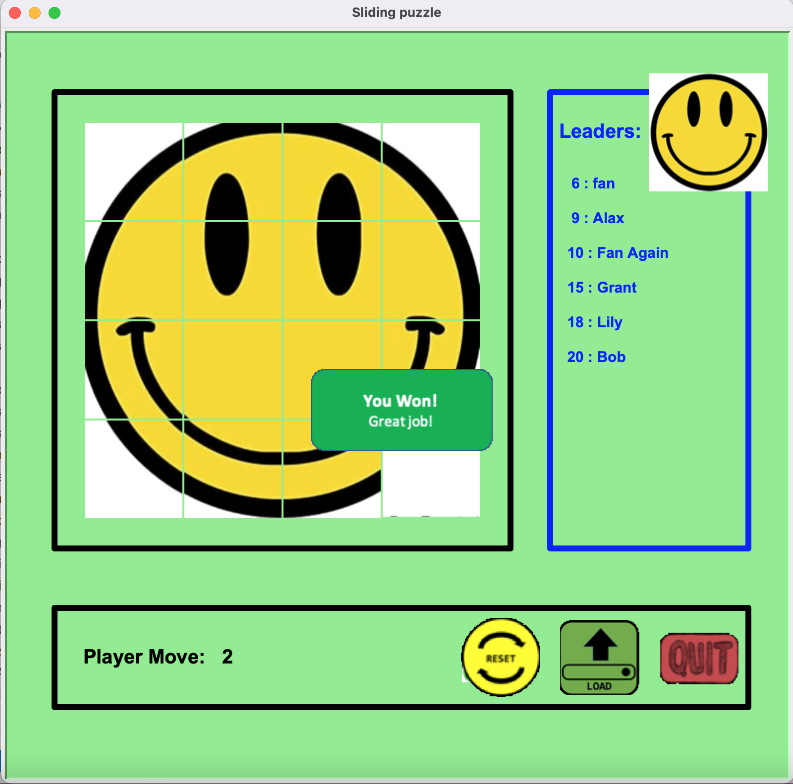
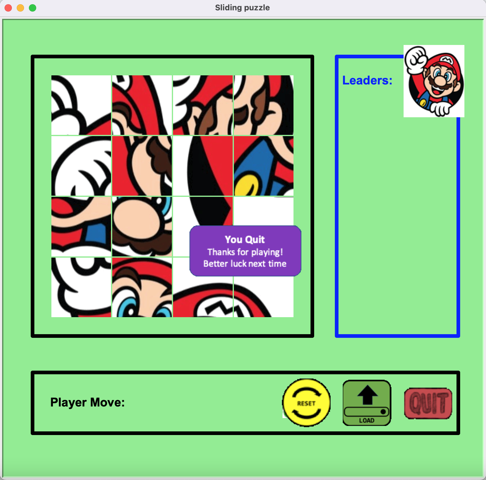

# Program of the Classic Game -- Sliding Puzzle

### General Introduction
- [ ] A fully functioning sliding puzzle game in Python with GUI interface
- [ ] Followed the Object Oriented Design concept, extracted features and grouped functionalities properly 
- [ ] Designed a simple and straightforward algorithm to handle tile behaviors
- [ ] Enabled entry components, such as name and maximum number of moves, to customize game for users
- [ ] Created a leaderboard that keeps track of the top 10 players and scores

### How to Play
- [ ] Input user name and set the maximum number of moves user will use, then use the mouse to play.
- [ ] Slide pieces vertically or horizontally on the board to establish an end result that matches a solution.
- [ ] User can also select to auto-unscramble the pieces, load new puzzles, or quit the game.
- [ ] Available puzzles: mario(default), fifteen, luigi, smiley, yoshi.

### Demo Screenshots

- the splash screen^

- input user name^

- input maximum number of moves to use^

- the main interface^

- the reset button can be used to auto-unscramble the pieces^

- the load button can be used to load new puzzles^

- user win!^

- user select to quit^

- the exit screen^

- the alert when no leaders has been added yet^
